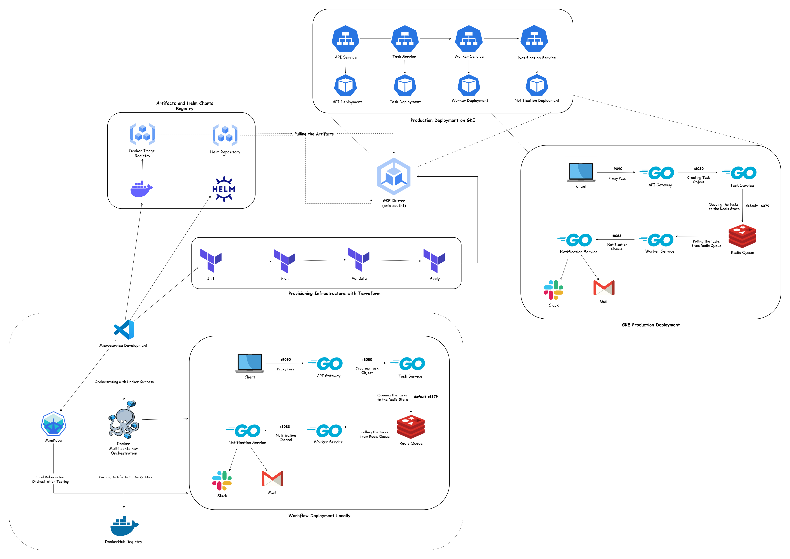
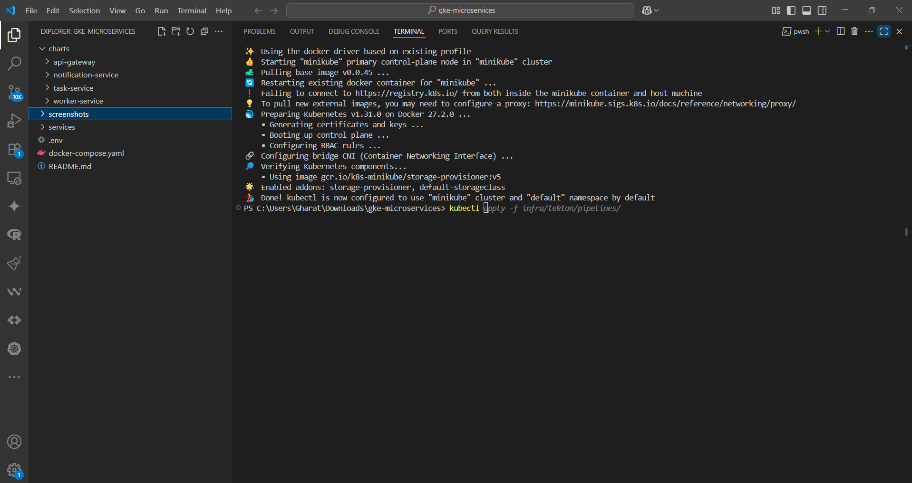
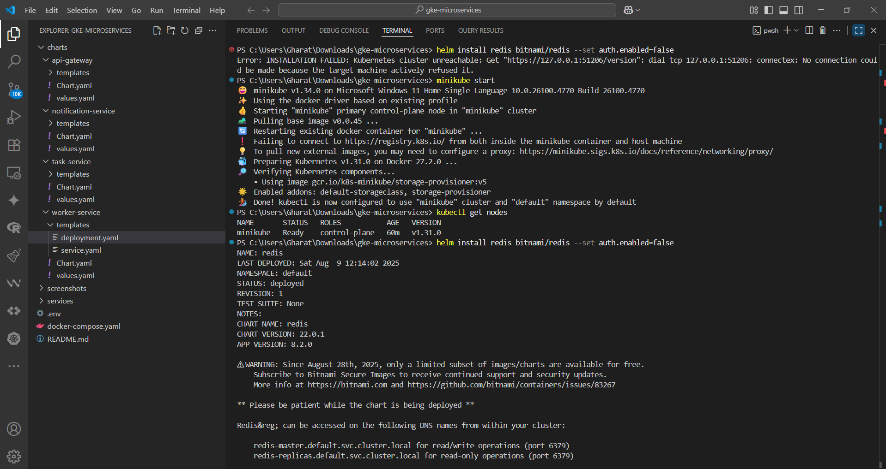
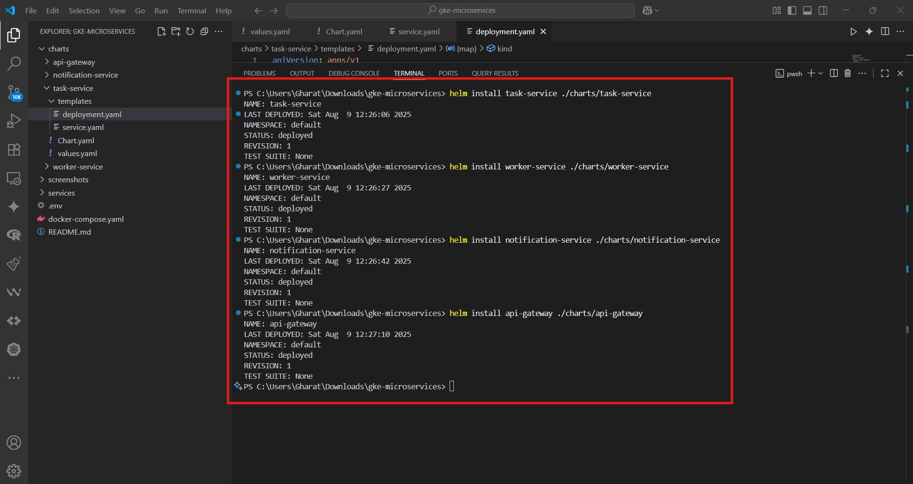
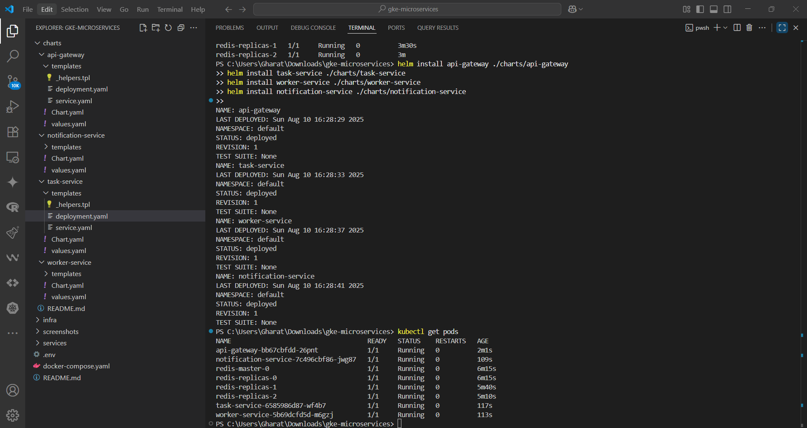
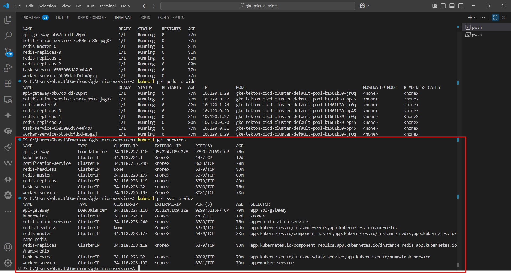
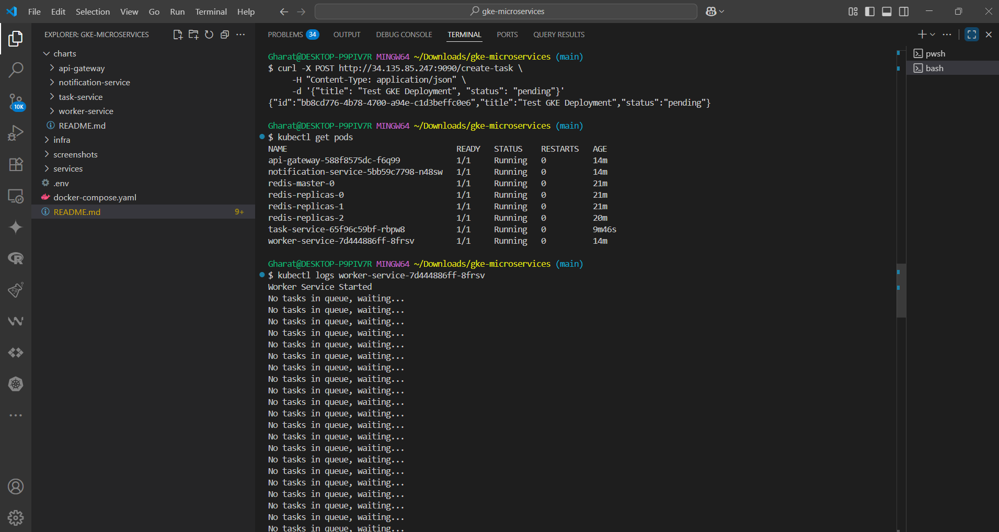

# Cloud-Native Microservices on Google Kubernetes Engine

[](https://golang.org/)
[](https://kubernetes.io/)
[](https://cloud.google.com/kubernetes-engine)
[](https://www.terraform.io/)
[](https://helm.sh/)
[](https://www.docker.com/)

Welcome! This repository provides a production-grade blueprint for designing, deploying, and managing a **cloud-native microservices architecture** on Google Cloud. It showcases a fully automated workflow that takes a collection of Go services from source code to a scalable, production-ready deployment on **Google Kubernetes Engine (GKE)**.

This project moves beyond simple examples. It's a real-world implementation of how to apply modern DevOps and SRE principles to backend development, including Infrastructure as Code (IaC), containerization, orchestration, and GitOps-style application management.

---

## Architecture Diagram



---

## Project Overview

The core objective is to demonstrate a robust, end-to-end workflow for microservices. The system is designed around an asynchronous task processing pattern, which is fundamental for building scalable and resilient applications.

This cloud-native approach ensures:
*   **Scalability**: Each microservice can be scaled independently on GKE to handle variable loads.
*   **Resilience**: The use of a message queue (Redis) decouples services, preventing cascading failures. If a worker is down, tasks queue up safely.
*   **Reproducibility**: Infrastructure is defined as code with Terraform, and application state is defined with Helm, ensuring consistent environments every time.
*   **Portability**: The entire application stack can be run locally with Docker Compose, on a local Kubernetes cluster like Minikube, or in a production GKE environment with minimal changes.

---

## Workflow

The system uses a decoupled, asynchronous pattern for task processing, orchestrated by a Redis message queue.

**Flow of execution:**
1.  A client sends a request to the **API Gateway**, the single entry point for the system.
2.  The API Gateway forwards the request to the **Task Service**.
3.  The **Task Service** validates the request, generates a task, and pushes it onto a **Redis Queue**.
4.  The **Worker Service**, a background processor, continuously polls the queue, consumes new tasks, and executes the required business logic.
5.  Upon completion, the Worker Service sends a confirmation to the **Notification Service**, which logs the final result.

```text
┌─────────────┐    ┌─────────────┐    ┌─────────────┐
│   Client    │───▶│ API Gateway │───▶│Task Service │
└─────────────┘    └─────────────┘    └─────────────┘
                                              │
                                              ▼
┌─────────────┐    ┌─────────────┐    ┌─────────────┐
│Notification │◀───│Worker Service│◀───│   Redis    │
│  Service    │    └─────────────┘    └─────────────┘
└─────────────┘
```

---

## Visual Showcase

### 1️⃣ Local Kubernetes Deployment with Minikube


### 2️⃣ Installing Redis with Helm


### 3️⃣ Deploying Microservices with Helm


### 4️⃣ Verifying Pods and Services on Minikube


### 5️⃣ Verifying Deployments and Pods on GKE


### 7️⃣ Validating End-to-End Flow via GKE Worker Logs


---

## Key Features

- **Infrastructure as Code**: GKE cluster and networking are fully managed by Terraform.
- **GitOps-style Deployments**: Helm charts define the desired state of the application in Kubernetes.
- **Asynchronous Processing**: Redis queue enables a robust, non-blocking task processing architecture.
- **Containerized Services**: Each Go microservice is packaged into a lightweight, optimized Docker image.
- **Environment Parity**: Seamlessly run the entire stack locally (Docker Compose), on a local K8s cluster (Minikube), or in the cloud (GKE).
- **Service Discovery**: Services communicate within the Kubernetes network using standard DNS names.

---

## Technology Stack

| Technology | Purpose |
| :--- | :--- |
| **Go (Golang)** | Language for building high-performance, concurrent microservices. |
| **Google Kubernetes Engine (GKE)** | Managed, production-ready Kubernetes for orchestrating containers. |
| **Terraform** | Infrastructure as Code (IaC) tool to provision and manage the GKE cluster. |
| **Helm** | The package manager for Kubernetes, used to define and deploy applications. |
| **Docker & Docker Compose** | Containerization of services and local development orchestration. |
| **Redis** | In-memory data store used as a high-speed message broker (task queue). |
| **Google Cloud** | Cloud provider for hosting all infrastructure and services. |

---

## Getting Started: Step-by-Step Guide

### Prerequisites

1.  **Google Cloud Project**: With billing enabled.
2.  **gcloud CLI**: Authenticated to your GCP account (`gcloud auth login`).
3.  **Terraform**: Installed locally.
4.  **Docker & Docker Compose**: Installed locally.
5.  **kubectl**: Installed locally.
6.  **Helm**: Installed locally.
7.  **Minikube**: (Optional) For local Kubernetes testing.

### Phase 1: Local Development with Docker Compose

This is the quickest way to run the entire application on your local machine.

1.  **Build and Run Services**
    This command builds the Docker images and starts all containers, including Redis.
    ```bash
    docker-compose up --build
    ```

2.  **Test the API**
    In a new terminal, send a request to create a task.
    ```bash
    curl -X POST http://localhost:9090/create-task \
      -H "Content-Type: application/json" \
      -d '{"title": "My First Task", "status": "pending"}'
    ```

3.  **Verify Logs**
    Observe the logs to see the `worker-service` process the task and the `notification-service` confirm it. 
    ```bash
    docker-compose logs -f worker-service notification-service
    ```

### Phase 2: Local Kubernetes with Minikube & Helm

1.  **Start Minikube**
    ```bash
    minikube start --cpus=4 --memory=8192
    ```

2.  **Install Redis**
    ```bash
    helm repo add bitnami https://charts.bitnami.com/bitnami
    helm install redis bitnami/redis
    ```

3.  **Deploy Microservices**
    *Note: Ensure your Docker images are available in a registry that Minikube can access (like Docker Hub) or build them into Minikube's Docker daemon.*
    ```bash
    helm install api-gateway ./charts/api-gateway
    helm install task-service ./charts/task-service
    helm install worker-service ./charts/worker-service
    helm install notification-service ./charts/notification-service
    ```

### Phase 3: Provisioning Cloud Infrastructure with Terraform

1.  **Navigate to the `infra` directory**
    ```bash
    cd infra
    ```

2.  **Initialize Terraform**
    This downloads the necessary provider plugins.
    ```bash
    terraform init
    ```

3.  **Apply the Configuration**
    This will provision the GKE cluster. Review the plan and type `yes` when prompted.
    ```bash
    terraform apply
    ```

### Phase 4: Deploying to GKE with Helm

1.  **Authenticate `kubectl`**
    Configure `kubectl` to communicate with your new GKE cluster.
    ```bash
    gcloud container clusters get-credentials <your-cluster-name> --zone <your-zone> --project <your-project-id>
    ```

2.  **Deploy Redis and Services to GKE**
    From the project root, run the same Helm commands used for Minikube. The charts are designed to work in any Kubernetes environment.
    ```bash
    # Install Redis
    helm install redis bitnami/redis

    # Install Microservices
    helm install api-gateway ./charts/api-gateway
    helm install task-service ./charts/task-service
    helm install worker-service ./charts/worker-service
    helm install notification-service ./charts/notification-service
    ```

3.  **Validate the Deployment**
    Check that all pods are running and find the external IP of the `api-gateway`.
    ```bash
    kubectl get pods
    kubectl get svc api-gateway
    ```

---

## Project Structure

```
.
├── charts/                  # Helm charts for Kubernetes deployments
│   ├── api-gateway/
│   ├── notification-service/
│   ├── task-service/
│   └── worker-service/
├── infra/                   # Terraform IaC for GKE cluster
│   ├── main.tf
│   ├── providers.tf
│   ├── terraform.tfvars
│   └── variables.tf
├── services/                # Go microservices source code
│   ├── api-gateway/
│   ├── notification-service/
│   ├── task-service/
│   └── worker-service/
├── screenshots/             # Evidence of steps & testing
├── .env                     # Environment variables (local)
├── docker-compose.yaml      # Local orchestration file
└── README.md                # This documentation
```

---

## Cleanup

To avoid ongoing charges, destroy the cloud resources when you are finished.

1.  **Delete Helm Releases**
    ```bash
    helm delete api-gateway task-service worker-service notification-service redis
    ```

2.  **Destroy GKE Infrastructure**
    Navigate to the `infra` directory and run the destroy command.
    ```bash
    cd infra
    terraform destroy -auto-approve
    ```

---

## Roadmap

- [ ]  **CI/CD Pipeline**: Set up a complete CI/CD pipeline using GitHub Actions or Cloud Build to automate image builds and Helm deployments.
- [ ] **Service Mesh**: Integrate Istio or Linkerd for advanced traffic management, mTLS security, and observability.
- [ ] **Monitoring & Alerting**: Add Prometheus for metrics collection and Grafana for creating insightful dashboards.
- [ ] **gRPC Communication**: Replace internal RESTful API calls with gRPC for improved performance and type safety.
- [ ] **Distributed Tracing**: Implement OpenTelemetry to trace requests across all microservices.

---

## Author

**Ayush Gharat**

*Cloud-Native Developer | Go | Kubernetes | Terraform*